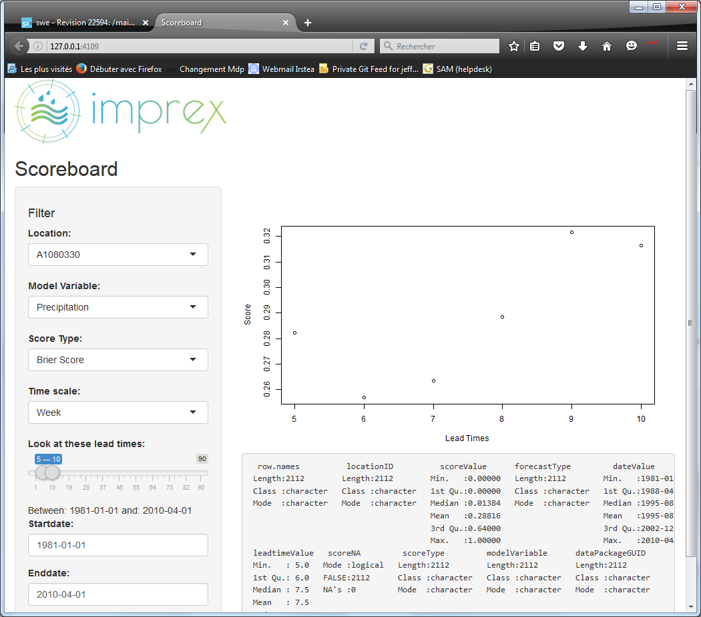
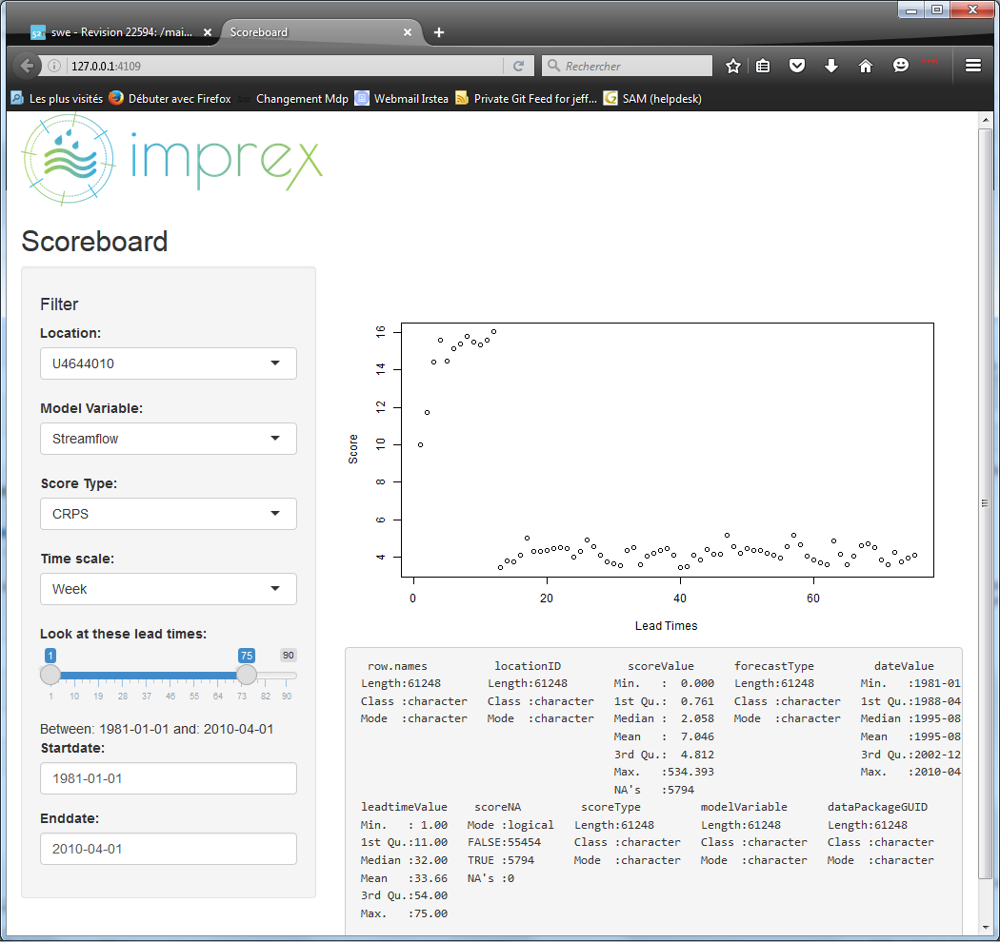

```{r setup, include=FALSE}
knitr::opts_chunk$set(echo = TRUE)
```


## Week 22, 2016
Welcome to week 13 of 34...

```{r plot il reste}
thesis.duration <- 34
this.week <- 13
yikes <- c(this.week, thesis.duration - this.week) / thesis.duration
barplot(as.matrix(yikes), horiz=TRUE, beside=FALSE)
# library(ggplot2)
# ggplot(yikes, aes(x = "time", y = thesis.duration))

```

Last week we discussed comparing the "time series" nature of forecast scores. This isn't complicated, but I've found it a little tricky to build the most sensible GUI around the three axes we need to display:

 - score values
 - date range over which they are valid (daily, weekly, monthly, seasonally)
 - lead time for this particular score
 
Lead time is how far ahead we are forecasting -- if I have a weather forecast for tomorrow's date with a lead time of 1, that's today's prediction for tomorrow's weather, and might be pretty good. If I have a streamflow forecast for tomorrow with a lead time of 30, that's a forecast I made last month for tomorrow's streamflow -- and looking at the forecast where leadtime equals 1 might give me a more current picture of the forecast.

We have been using daily and monthly score values of seasonal forecasts 

I have a dataset from our friends in Sweden which begins on 1982-1-1 and ends 2009-12-31. R tells me there's a "Time difference of 10226 days" (as.Date(fcst$End_date) - as.Date(fcst$Start_date)), though we have 9900 records (326 short).

In order to compare these records with existing data I need to average our current (ECMWF) scores over a month; I can conserve the stats, but since I don't have a place in the DB to put stats I decided it's best to redo the calcs ... then the user can drill deeper into resolution of ECMWF score series than, for example, data averaged by month.


Here are last week's screens ... will load new ones today I hope:



Note these Brier scores are raw, still not normalized ... wups.

TODO: for example a skill calculation root-mean squared error (RMSE):
$$ RMSE = {\sqrt {\frac{1} {N}{\sum\limits_{i = 1}^N {(c_{i} - \bar{c}_{i} } })^{2} } }   $$

Skill score (SS) associated with RMSE:
$$ SS = 1 - \frac{ RMSE _{forecast}}{RMSE _{observations}} $$



Another point ... We're using data with daily scores calculated, AND data with monthly score averages. I'll handle these in the interface.

NOTE: handle these in R...

I've been adding notes to a LaTeX outline for the thesis document -- "memoire", en français. At this moment I've got multi-lingual abstracts, but am writing in English...

Got access to a 2013 netCDF [development branch for SOS DB] (https://svn.52north.org/svn/swe/main/SOS/Service/branches/52n-sos-netCDF/), so I'll look into that this week to understand better our options for accomodating netCDF files (a requirement which became more likely last week).

This week I need to: 
* finish loading our current "draft" data
    + SMHI forecast model (EHYPE) scores and potentially observations

* deploy AWS instance of shiny server
    + http://www.r-bloggers.com/installing-rstudio-shiny-server-on-aws/
    + for when shinyapps.io stops hosting us
    + which'll solve the ".Rfiles" hosting problem (~~currently shiny deploy breaks these files~~)
    + update: according to [a note here](https://groups.google.com/forum/#!msg/shinyapps-users/dMjMJlk0cPQ/kB4GiIE7DQAJ) this is actually solvable using rsconnect:deployApp()... to be continued

* decide if the SOS database format is the way to go forward,
    + which makes maintenance easier
    + more durable
    + bit trickier upfront !
* mysteries to solve
    + ...
* R fundamentals I still need
    + ~~ggplot2~~
    + facet()
* Some helpful r debugging links:
    + http://www.stats.uwo.ca/faculty/murdoch/software/debuggingR/
    + http://shiny.rstudio.com/articles/debugging.html

This week so far I am also reading and writing:

* Reading:
    + http://shiny.rstudio.com/reference/shiny/latest/session.html

* More Reading:
    + Colleagues published a paper on drought-resistant governance: 
    http://link.springer.com/chapter/10.1007/978-3-319-29671-5_11/fulltext.html
    

SLIGHTLY STALE NOTES I'm keeping here for my reference:
Structure for the scores, likely netCDF, .Rdata lists - currently receiving text files and 3D "cubes" depending on source... tidying takes time; should be automated so users may load / arrange their scores (like EVS).

I had anticipated CSV files since that seems to be the local standard for data exchange, maybe this will be a pleasant surprise.

NetCDF links:
http://www.unidata.ucar.edu/software/netcdf/docs/faq.html#How-do-I-convert-netCDF-data-to-ASCII-or-text
http://www.unidata.ucar.edu/software/netcdf/examples/files.html
Discussion(s) of handling time using netCDF:
http://www.unidata.ucar.edu/software/netcdf/time/
http://www.unidata.ucar.edu/software/netcdf/time/recs.html

Some NetCDF files from our friends at ECMWF:
http://apps.ecmwf.int/datasets/

O'Reilly always publishes goodness, re-reminging myself to remember this later:
http://www.cookbook-r.com/Graphs/

Something to look into on my time -- confidence Intervals discussed in different context:
http://learnbayes.org/papers/confidenceIntervalsFallacy/introduction.html
...with nifty Shiny app to illustrate Figs 1 - 5 from article:
https://richarddmorey.shinyapps.io/confidenceFallacy/
http://learnbayes.org/papers/confidenceIntervalsFallacy/

Tools for LaTeX:
https://www.codecogs.com/latex/eqneditor.php

