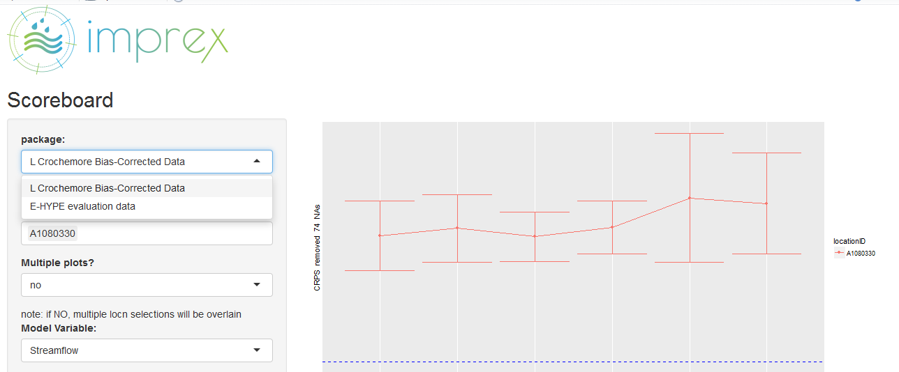
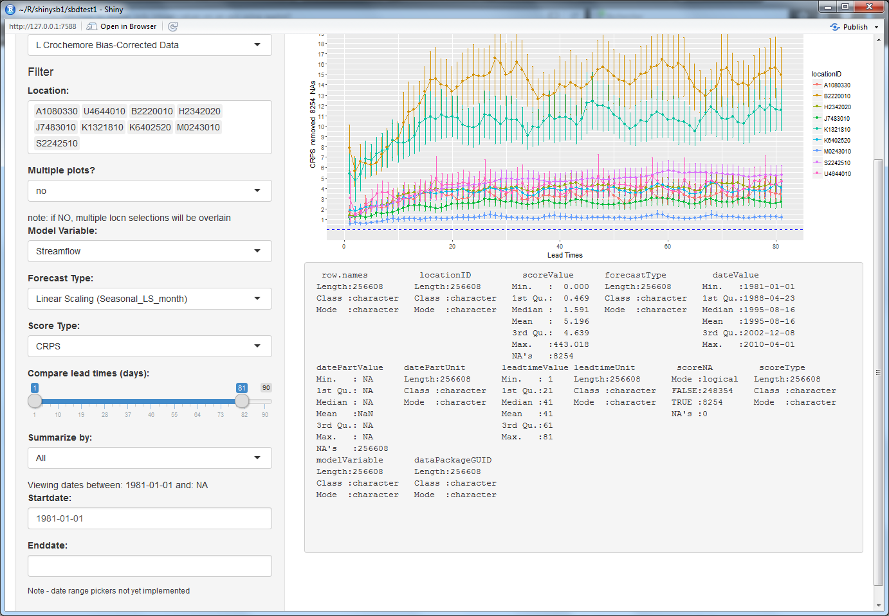

```{r setup, include=FALSE}
knitr::opts_chunk$set(echo = TRUE)
```


# Week 24, 2016
Welcome to week 15 of 34. This document updated 17 juin 2016.

```{r plot il reste}
thesis.duration <- 34
this.week <- 15
yikes <- c(this.week, thesis.duration - this.week) / thesis.duration
barplot(as.matrix(yikes), horiz=TRUE, beside=FALSE)
# library(ggplot2)
# ggplot(yikes, aes(x = "time", y = thesis.duration))

```

## Big changes:
 - ggplot changes including "dodge" and better grouping 
   - easy lables! 
   - facets, 
   - boxplots (not used in app), 

## Modified database schema:
- new numeric field for partial dates
- which required a text field for partial date units (day (default); week; month; quarter; year)

We're likely simplifying the display significantly; I've been developing on a dataset that has more locations, and higher resolution of data, than we're likely to see (unless we request raw output and observation files à la EVS).

This will decrease the record count in the future database, and remove ability / motiviation for including confidence intervals, standard error, etc in the dataset.

I'm also adding a layer of reactivity BEFORE the filter function; now we have a box filled by database which lists which packages are available:



# Images of current interface





Got access to a 2013 netCDF [development branch for SOS DB] (https://svn.52north.org/svn/swe/main/SOS/Service/branches/52n-sos-netCDF/), so I'll look into that this week to understand better our options for accomodating netCDF files (a soft requirement which we won't implement without motivation!).

This week I need to: 
* Change interface:
    + reduce "summary";
    + reduce emphasis on ci();
    + add ability to post 2eme Score Type to same page (or more?)

* prep slides for 10 minute "wave peaks" presentation
    + less technic, more "qualitative" study
    + underscore the utility in comparing score types
    + examples of other scoreboards...?

* re-deploy AWS instance
    + http://www.r-bloggers.com/installing-rstudio-shiny-server-on-aws/
    + which'll solve the ".Rfiles" hosting problem (~~currently shiny deploy breaks these files~~)
    + update: according to [a note here](https://groups.google.com/forum/#!msg/shinyapps-users/dMjMJlk0cPQ/kB4GiIE7DQAJ) this is actually solvable using rsconnect:deployApp()... to be continued

* Some helpful r debugging links:
    + http://www.stats.uwo.ca/faculty/murdoch/software/debuggingR/
    + http://shiny.rstudio.com/articles/debugging.html

Keeps coming back up (particularly for multiple users in web app!) but not dealt with:
    + http://shiny.rstudio.com/reference/shiny/latest/session.html


### SLIGHTLY STALE NOTES I'm keeping here for my reference:

NetCDF links:
http://www.unidata.ucar.edu/software/netcdf/docs/faq.html#How-do-I-convert-netCDF-data-to-ASCII-or-text
http://www.unidata.ucar.edu/software/netcdf/examples/files.html
Discussion(s) of handling time using netCDF:
http://www.unidata.ucar.edu/software/netcdf/time/
http://www.unidata.ucar.edu/software/netcdf/time/recs.html

Some NetCDF files from our friends at ECMWF:
http://apps.ecmwf.int/datasets/

O'Reilly always publishes goodness, re-reminging myself to remember this later:
http://www.cookbook-r.com/Graphs/

Something to look into on my time -- confidence Intervals discussed in different context:
http://learnbayes.org/papers/confidenceIntervalsFallacy/introduction.html
...with nifty Shiny app to illustrate Figs 1 - 5 from article:
https://richarddmorey.shinyapps.io/confidenceFallacy/
http://learnbayes.org/papers/confidenceIntervalsFallacy/

Tools for LaTeX:
https://www.codecogs.com/latex/eqneditor.php

