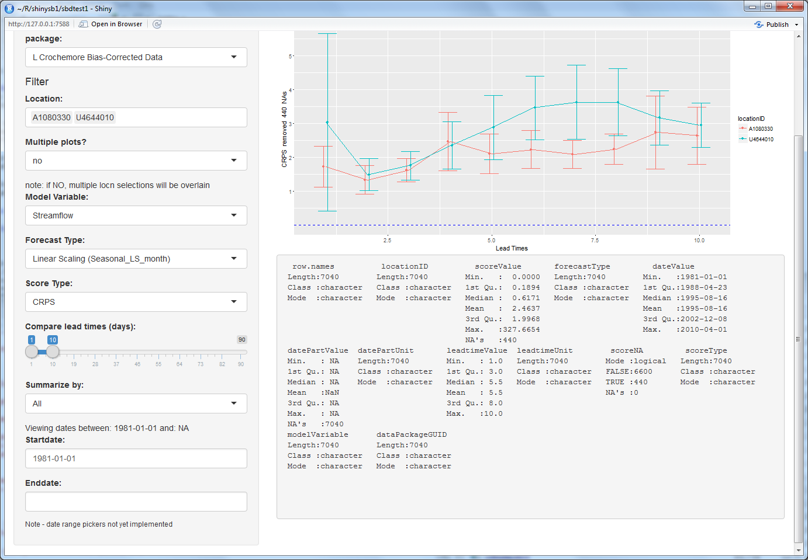

```{r setup, include=FALSE}
knitr::opts_chunk$set(echo = TRUE)
```
# Week 26, 2016
Welcome to week 17 of 25. This document updated 30 juin 2016. 

```{r plot il reste}
thesis.duration <- 25
this.week <- 17
double.yikes <- c(this.week, thesis.duration - this.week) / thesis.duration
barplot(as.matrix(double.yikes), horiz=TRUE, beside=FALSE)
# library(ggplot2)
# ggplot(double.yikes, aes(x = "time", y = thesis.duration))

```

Note that I have been making a gross over-assumtion of my remaining time -- this isn't a 34-week internship, but about 26 (or 25 with vacation). The 34th week of the year (beginning August 22) will be my last week, but since my 2nd week was week 10, my plot has been quite wrong.

## What's new:
- Discussed conditional criteria for Scoreboard
- Designated three documents for delivery at end of stage:
  1. short userguide (part of shiny app?) - English
  2. ultra-clear Database HOWTO guide (howto add data, DDL, etc) (so MHR can direct others setting up new DBs)
  3. longer write-up for data submitters


 - Got rid of summary() field
 - Added 2nd plot window
 - using DT better
 - not complete:
   - renderUI()
   - two plot regimes:
     - stats on daily values (se, ci)
     - direct score plots
 - goal is to view skill scores (comparable) in addition to raw scores (not so comparable)
   - "All Skill Score" plot which should show red, grey, green "improving or not" scores
 - Review EVS Documentation and datafile in / out

## Modified database schema:
 - Renaming?


 
```{r plot plot from shiny}
library(dplyr)
library(lazyeval)
library(ggplot2)

play.data <- read.delim("~/R/shinysb1/play.data.txt")
play.data$locationID <- as.factor(play.data$locationID)
plot(play.data$leadtimeValue, play.data$scoreValue, col=play.data$locationID, 
     xlab = "Lead Times", ylab = "Score")
     
# get fancier
pd <- position_dodge(0.2)
min.LT <- min(play.data$leadtimeValue)
max.LT <- max(play.data$leadtimeValue)

ggplot(play.data, aes(color = locationID, x = leadtimeValue, y = scoreValue )) +
  geom_errorbar(aes(ymin=scoreValue-ci, ymax=scoreValue+ci), position = pd) + # , color="grey"
  geom_line() +
  geom_point(aes(color = locationID), position = pd) +
  geom_hline(aes(yintercept=0), color="blue", linetype="dashed") + 
  scale_y_continuous(breaks=c(min.LT:max.LT)) +
  xlab("Lead Times") + ylab("Score")
     
```

 
 

We also simplified the wording on the display again; I need to follow this with database logic to be sure names are clear and sensible (self-documenting).

I'm also adding a layer of reactivity BEFORE the filter function; now we have a box filled by database which lists which packages are available:


# Images of current interface


This week I need to: 

* prep slides for 10 minute "wave peaks" presentation
    + less technic, more "qualitative" study
    + underscore the utility in comparing score types
    + examples of other scoreboards...?
    
* Enhance data import definition 
    + example file
    + user preview (?) before database import run
    
* Change interface:
    + reduce "summary";
    + reduce emphasis on conf interval plot (ci and se agglom function, summarySE);
    + add ability to post 2eme Score Type to same page (or more?)
    
Planning:
* ggplot libraries
    + facet;
    + map (GDAL);
    


### Old Notes (for my reference):

Got access to a 2013 netCDF [development branch for SOS DB] (https://svn.52north.org/svn/swe/main/SOS/Service/branches/52n-sos-netCDF/), so I'll look into that this week to understand better our options for accomodating netCDF files (a soft requirement which we won't implement without motivation!).

* Some helpful r debugging links:
    + http://www.stats.uwo.ca/faculty/murdoch/software/debuggingR/
    + http://shiny.rstudio.com/articles/debugging.html

Keeps coming back up (particularly for multiple users in web app!) but not dealt with:
    + http://shiny.rstudio.com/reference/shiny/latest/session.html

NetCDF links:
http://www.unidata.ucar.edu/software/netcdf/docs/faq.html#How-do-I-convert-netCDF-data-to-ASCII-or-text
http://www.unidata.ucar.edu/software/netcdf/examples/files.html
Discussion(s) of handling time using netCDF:
http://www.unidata.ucar.edu/software/netcdf/time/
http://www.unidata.ucar.edu/software/netcdf/time/recs.html

Some NetCDF files from our friends at ECMWF:
http://apps.ecmwf.int/datasets/

O'Reilly always publishes goodness, re-reminging myself to remember this later:
http://www.cookbook-r.com/Graphs/

Something to look into on my time -- confidence Intervals discussed in different context:
http://learnbayes.org/papers/confidenceIntervalsFallacy/introduction.html
...with nifty Shiny app to illustrate Figs 1 - 5 from article:
https://richarddmorey.shinyapps.io/confidenceFallacy/
http://learnbayes.org/papers/confidenceIntervalsFallacy/

Tools for LaTeX:
https://www.codecogs.com/latex/eqneditor.php

